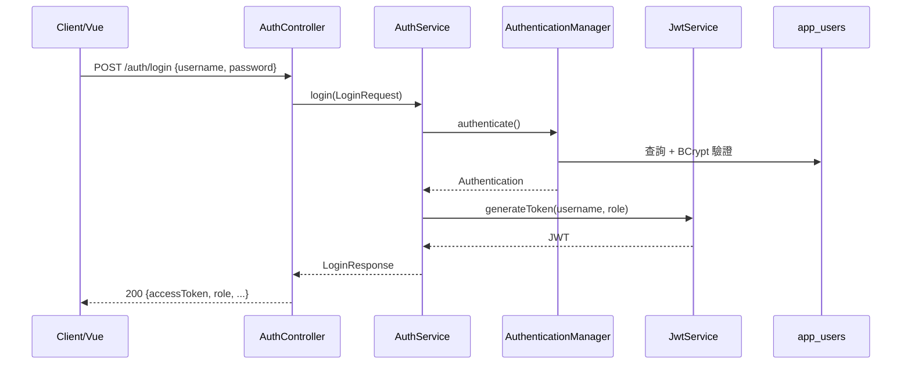
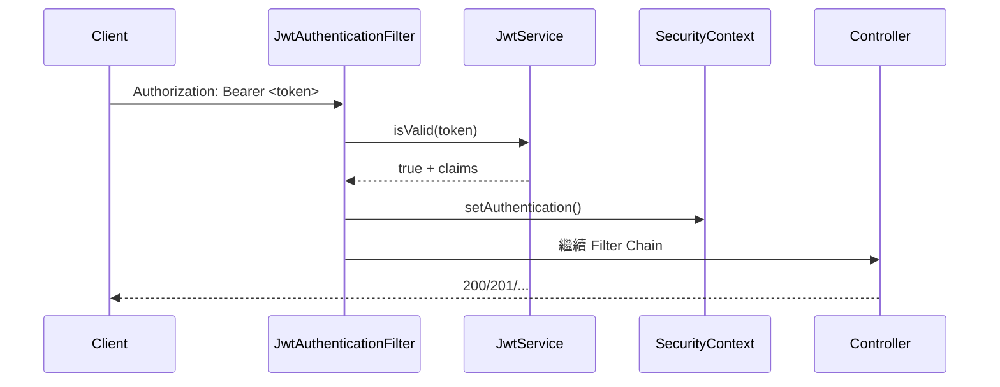
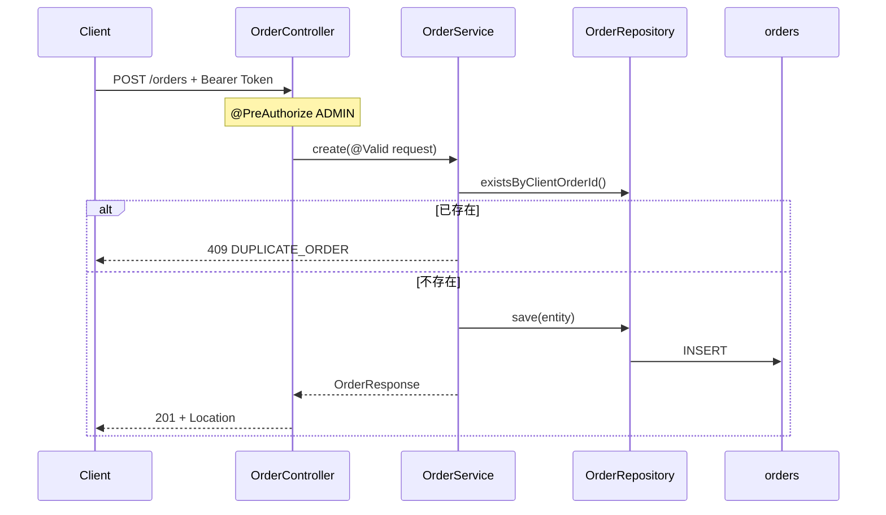
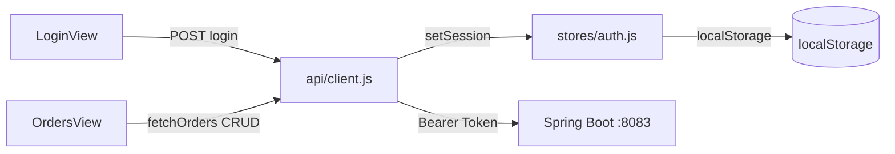

# TradingCRUD — 功能流程說明

> 每個 API「做什麼、怎麼跑」，含 Mermaid 流程圖。

---

## 1. 登入流程



---

## 2. 受保護請求（JWT Filter）



未帶 Token → `RestAuthenticationEntryPoint` → 401

---

## 3. 新增訂單（CRUD Create）



---

## 4. 查詢列表（分頁 + 篩選）

```text
GET /api/v1/orders?symbol=BTCUSDT&status=NEW&page=0&size=20
  → OrderController.list()
  → OrderService.list() [@Transactional(readOnly=true)]
  → OrderRepository.search() [JPQL + Pageable]
  → PagedResponse { data[], meta { page, size, total } }
```

---

## 5. 批次新增

```text
POST /api/v1/orders/batch { orders: [...] }
  → OrderBatchController.batchCreate()
  → OrderService.batchCreate()
       for each order:
         - 批次內重複 → failures[]
         - DB 已存在 → failures[]
         - 成功 → createdIds[]
  → failed==0 ? 201 : 207
```

---

## 6. 前端資料流



---

## 7. Node BFF 流程（正式模式）

```text
瀏覽器 GET /orders（Vue Router）
  → Node :3000 app.get('*') → index.html
  → Vue 渲染 OrdersView
  → axios GET /api/v1/orders
  → Node proxy → Spring Boot :8083
```

---

*最後更新：2026-07-09*
