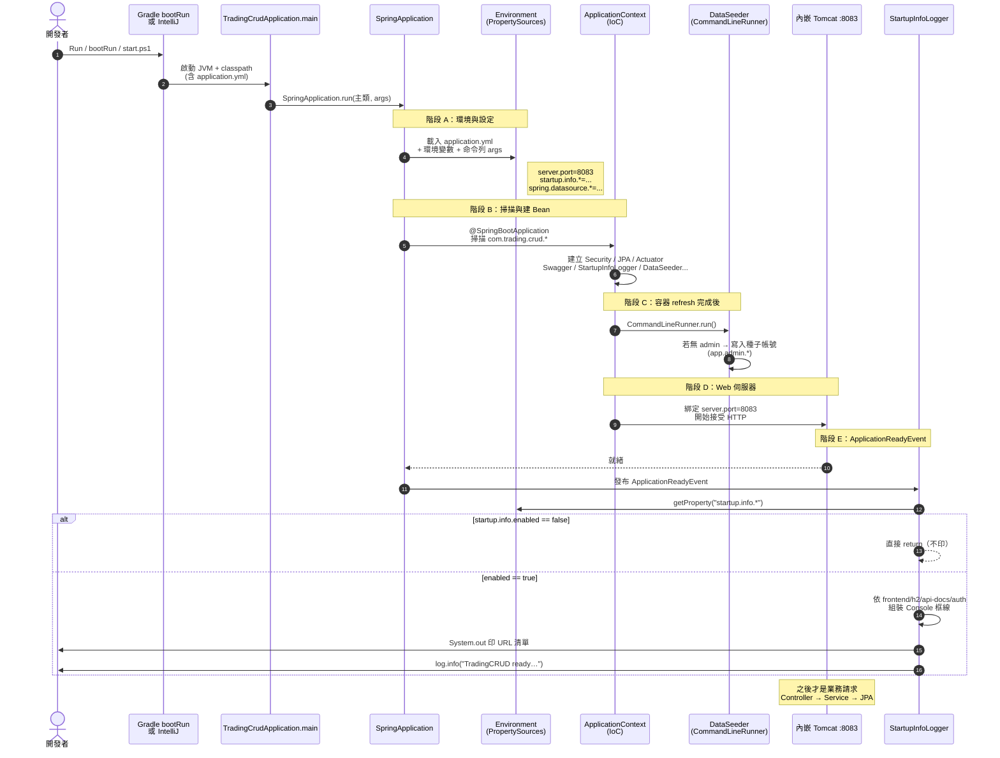
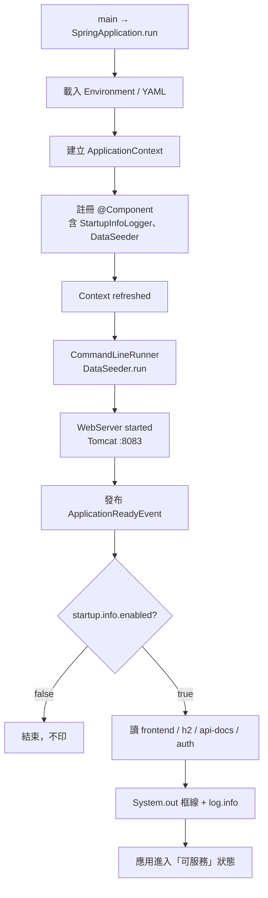
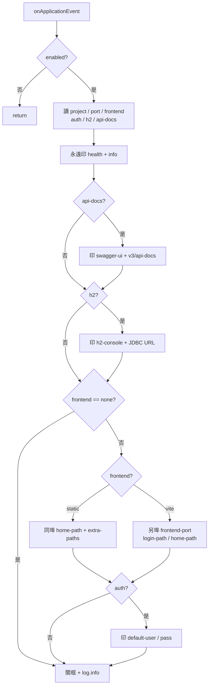
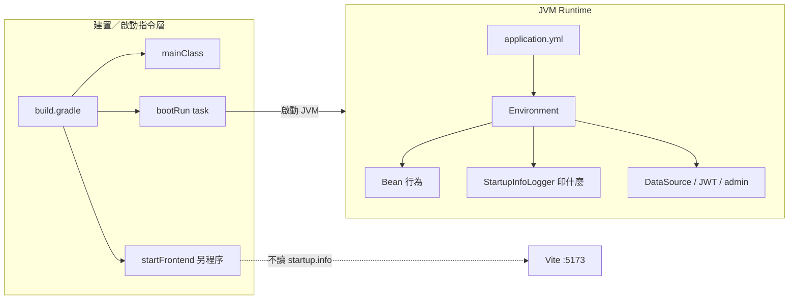

# TradingCRUD — 系統啟動與 StartupInfoLogger 運作流程

> 說明從 Gradle／IntelliJ 啟動到 Console 印出常用 URL 的完整 runtime 路徑。  
> 其他專案（FinTech／PagingList／PrometheusActuator 等）採**同一套作法**，差異主要在 `startup.info.*` 與埠號。  
> **瀏覽版（建議）：** [啟動與StartupInfoLogger運作流程.html](啟動與StartupInfoLogger運作流程.html)

---

## 1. 一句話

`bootRun`／IntelliJ 只負責把 `TradingCrudApplication` 拉起來；Spring 把 `application.yml` 灌進 `Environment` 並建好 Bean；`DataSeeder` 先種 admin；Tomcat 開 `:8083` 後發 `ApplicationReadyEvent`；`StartupInfoLogger` 再依 `startup.info.*` 決定 Console 印哪些連結。

---

## 2. 誰觸發啟動（三種入口，本質相同）

| 入口 | 實際做的事 |
|------|------------|
| IntelliJ `TradingCrudApplication` | 直接跑 `main`，主類 `com.trading.crud.TradingCrudApplication` |
| IntelliJ / CLI `gradlew bootRun` | Boot plugin 用 `build.gradle` 的 `springBoot.mainClass` 起同一支 `main` |
| `scripts/start.ps1` | 新視窗跑 `gradlew bootRun`，再另開 Vite `:5173`（前端與後端無關） |

`build.gradle` 關鍵：

```gradle
springBoot {
    mainClass = 'com.trading.crud.TradingCrudApplication'
}

tasks.named('bootRun') {
    group = 'application'
    description = 'Run backend at http://localhost:8083'
}
```

注意：`bootRun` **不會**解析 `startup.info.*`；YAML 是 JVM 起來後由 Spring 讀的。

---

## 3. Sequence：從按 Run 到 Console 印框



---

## 4. YAML 何時進 Runtime、怎麼被讀到

`src/main/resources/application.yml` 打包進 classpath；Spring 啟動時掛進 `Environment`（優先序大致：命令列 > 環境變數 > YAML）。

與啟動印 URL **直接相關**：

```yaml
startup:
  info:
    enabled: true
    project-name: TradingCRUD
    frontend: vite            # none | static | vite
    auth: true
    h2: true
    api-docs: true
    frontend-port: 5173
    home-path: /orders
    login-path: /login
    default-user: admin
    default-pass: admin123
```

| YAML | Runtime key | 用途 |
|------|-------------|------|
| `startup.info.enabled` | 同上 | `false` 則整段不印 |
| `startup.info.project-name` | 同上 | 框標題 |
| `server.port` | 同上 | 組 `http://localhost:{port}` |
| `startup.info.frontend` | 同上 | `none` / `static` / `vite` |
| `startup.info.h2` / `api-docs` / `auth` | 同上 | 條件區塊開關 |
| `spring.datasource.url` | 同上 | 印 H2 JDBC（若 `h2: true`） |

**改 YAML 不必改 Java**；`StartupInfoLogger` 只做「讀 Environment → 印字」。

---

## 5. Spring 生命週期位置



為何聽 `ApplicationReadyEvent` 而不是建構子／`@PostConstruct`？

- 那時 Tomcat 可能還沒綁好埠，印 URL 太早會誤導。
- `CommandLineRunner`（`DataSeeder`）在 Ready **之前**跑：先有 admin，再開門接請求，再印連結。

事件順序（簡化）：

1. `ApplicationContext` refresh 完成  
2. `CommandLineRunner` / `ApplicationRunner`（→ `DataSeeder`）  
3. 內嵌 WebServer start  
4. **`ApplicationReadyEvent`**（→ `StartupInfoLogger`）

---

## 6. StartupInfoLogger 內部決策



TradingCRUD 現行設定會走出：**後端工具列 + Swagger + H2 + Vite 前台區塊 + 預設帳密**。

---

## 7. Gradle 與 YAML 的分工



| 層 | 負責 |
|----|------|
| **Gradle** | 編譯、哪個 main、`bootRun`、前端腳本 |
| **YAML** | 埠、DB、JWT、Console 要印哪些連結 |
| **StartupInfoLogger** | 不啟動前端、不連線驗證 URL，只讀設定印字 |

`start.ps1` 自己也印一輪 URL（腳本層）；`StartupInfoLogger` 是後端進程就緒後再印一輪（runtime 層）。兩者內容刻意對齊，來源不同。

---

## 8. 啟動後才發生的業務路徑

啟動完成後，請求才走：

`HTTP :8083` → Security Filter → Controller → Service → JPA/H2

這與 `startup.info` **無關**。`startup.info` 只影響開發體驗的 Console 輸出。

測試環境可用 `application-test.yml` 覆寫 DB／JWT；要安靜啟動可加：

```yaml
startup.info.enabled: false
```

或測試屬性：`startup.info.enabled=false`。

---

## 9. 其他專案是否同一作法？

**是。** 同一條鏈：

`main` → 讀 `application.yml` → Bean（含 `StartupInfoLogger`）→（可選）`CommandLineRunner` → Tomcat → `ApplicationReadyEvent` → 依 `startup.info.*` 印 URL。

差異只在 YAML／套件名／有無種子／有無前端：

| 專案 | port | frontend | h2 | api-docs | 備註 |
|------|------|----------|-----|----------|------|
| **TradingCRUD** | 8083 | `vite` (:5173) | true | true | 有 `DataSeeder` + JWT auth |
| **TradingPagingList** | 8091 | `vite` (:5174) | true | true | 有產品種子；無 auth |
| **TradingFinTech** | 8092 | `none` | true | true | API-only；Kafka／Redis 可降級 |
| **TradingPrometheusActuator** | 8090 | `none` | false | false | 無 DB／Swagger；`extra-paths` 印 prometheus／trades |

套用時固定三件：

1. 複製／改 package 的 `StartupInfoLogger.java`  
2. `application.yml` 貼上對應的 `startup.info.*`  
3. （可選）`build.gradle` 指定 `springBoot.mainClass` + `bootRun`

範本目錄：[`docs/templates/`](templates/README.md)。

---

## 10. 相關檔案速查

| 檔案 | 角色 |
|------|------|
| `TradingCrudApplication.java` | `main` 入口 |
| `build.gradle` | `mainClass`、`bootRun`、`startFrontend` |
| `src/main/resources/application.yml` | 埠、DB、JWT、`startup.info.*` |
| `config/StartupInfoLogger.java` | 聽 Ready 事件、印 URL |
| `config/DataSeeder.java` | `CommandLineRunner` 種子 admin |
| `scripts/start.ps1` | 一鍵後端 + 前端（腳本層印 URL） |
| `.idea/runConfigurations/*` | IntelliJ Run Config |

---

*最後更新：2026-07-17*
