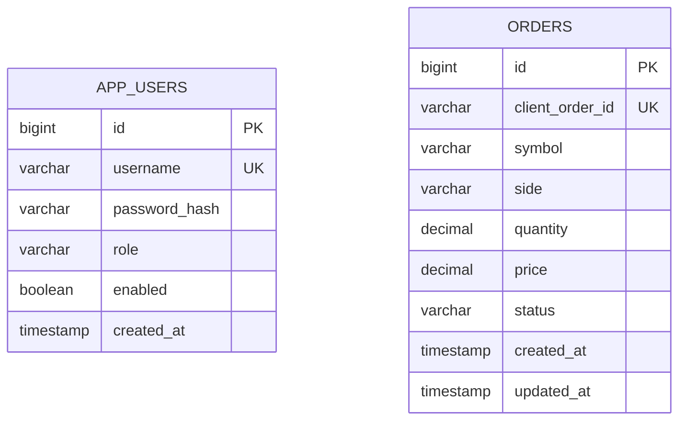

# TradingCRUD 資料庫設計

> **用途：** 說明 JPA Entity 與資料表對應、Repository 查詢、H2/PostgreSQL 切換、SQL 驗證 SOP。  
> **權威來源：** `OrderEntity`、`UserEntity`、`OrderRepository`；本文件為設計說明與驗證手冊。

---

## 1. 架構概覽

```text
┌──────────────┐     ┌──────────────┐     ┌─────────────────┐
│ Controller   │────►│ Service      │────►│ Repository      │
│ (HTTP)       │     │ (@Transactional)│  │ (Spring Data JPA)│
└──────────────┘     └──────────────┘     └────────┬────────┘
                                                    │
                                                    ▼
                                           ┌─────────────────┐
                                           │ H2 / PostgreSQL │
                                           │ orders          │
                                           │ app_users       │
                                           └─────────────────┘
```

**原則：**
- Controller 不直接操作 Repository
- Service 負責交易邊界（`@Transactional`）
- Entity 只做資料映射，商業規則在 Service

---

## 2. ER 圖



> 本專案 orders 與 app_users **無外鍵關聯**；授權由 JWT + Spring Security 處理，不將 user_id 寫入 orders。

---

## 3. 資料表定義

### 3.1 `app_users`（使用者）

| 欄位 | 型別 | 約束 | 說明 |
|------|------|------|------|
| id | BIGINT | PK, AUTO_INCREMENT | 主鍵 |
| username | VARCHAR(64) | NOT NULL, UNIQUE | 登入帳號 |
| password_hash | VARCHAR | NOT NULL | BCrypt 雜湊，不存明文 |
| role | VARCHAR(16) | NOT NULL | `ADMIN` / `USER` |
| enabled | BOOLEAN | NOT NULL, DEFAULT true | 帳號啟用 |
| created_at | TIMESTAMP | NOT NULL | 建立時間 |

**JPA 對應：** `UserEntity` → `@Table(name = "app_users")`

**種子資料：** `DataSeeder` 在啟動時若無 admin 則建立（`ADMIN_USERNAME` / `ADMIN_PASSWORD` 環境變數可覆寫）。

### 3.2 `orders`（訂單）

| 欄位 | 型別 | 約束 | 說明 |
|------|------|------|------|
| id | BIGINT | PK, AUTO_INCREMENT | 主鍵 |
| client_order_id | VARCHAR(64) | NOT NULL, UNIQUE | 業務冪等 ID |
| symbol | VARCHAR(20) | NOT NULL | 交易標的，如 BTCUSDT |
| side | VARCHAR(4) | NOT NULL | `BUY` / `SELL` |
| quantity | DECIMAL(18,8) | NOT NULL, > 0 | 數量 |
| price | DECIMAL(18,8) | NOT NULL, > 0 | 價格 |
| status | VARCHAR(20) | NOT NULL | 見 OrderStatus enum |
| created_at | TIMESTAMP | NOT NULL | 建立時間 |
| updated_at | TIMESTAMP | NOT NULL | 更新時間 |

**JPA 對應：** `OrderEntity` → `@Table(name = "orders")`

**OrderStatus 枚舉：**

| 值 | 說明 |
|----|------|
| NEW | 新建 |
| PARTIALLY_FILLED | 部分成交 |
| FILLED | 完全成交 |
| CANCELLED | 已取消 |
| REJECTED | 已拒絕 |

---

## 4. Repository 查詢對照

| 方法 | 類型 | 用途 | 對應 API |
|------|------|------|----------|
| `findById(Long)` | 命名查詢 | 單筆查詢 | GET `/orders/{id}` |
| `existsByClientOrderId(String)` | 命名查詢 | 冪等檢查 | POST `/orders` 防重複 |
| `search(symbol, status, Pageable)` | JPQL | 分頁篩選 | GET `/orders` |
| `save(OrderEntity)` | JPA | 新增/更新 | POST/PUT |
| `delete(OrderEntity)` | JPA | 刪除 | DELETE |

**JPQL 分頁查詢（`OrderRepository.search`）：**

```sql
-- 等價 SQL 概念（實際由 Hibernate 產生）
SELECT * FROM orders
WHERE (:symbol IS NULL OR symbol = :symbol)
  AND (:status IS NULL OR status = :status)
ORDER BY created_at DESC
LIMIT :size OFFSET :offset
```

---

## 5. 環境與連線設定

### 5.1 本機開發（H2 in-memory）

```yaml
# application.yml
spring:
  datasource:
    url: jdbc:h2:mem:tradingcrud;DB_CLOSE_DELAY=-1;MODE=PostgreSQL
    username: sa
    password:
  jpa:
    hibernate:
      ddl-auto: update
```

| 項目 | 值 |
|------|-----|
| H2 Console | http://localhost:8083/h2-console |
| JDBC URL | `jdbc:h2:mem:tradingcrud` |
| 帳號 | `sa` / 密碼空白 |

### 5.2 正式環境（PostgreSQL）

```powershell
$env:DB_URL = "jdbc:postgresql://localhost:5432/tradingcrud"
$env:DB_USERNAME = "postgres"
$env:DB_PASSWORD = "your-password"
$env:DB_DRIVER = "org.postgresql.Driver"
.\gradlew.bat bootRun
```

`ddl-auto: update` 會自動建表；生產建議改為 Flyway/Liquibase 遷移。

---

## 6. 資料流（以新增訂單為例）

```text
POST /api/v1/orders
  → OrderController.create(@Valid CreateOrderRequest)
  → OrderService.create()
       1. existsByClientOrderId() → 重複則拋 DuplicateResourceException (409)
       2. OrderMapper.toEntity()  → DTO 轉 Entity，status 預設 NEW
       3. orderRepository.save()  → INSERT INTO orders
  → OrderMapper.toResponse()     → 不回傳 Entity，只回 DTO
  → 201 Created + Location header
```

---

## 7. SQL 驗證 SOP

每次修改 Entity 或 Repository 後執行：

| 步驟 | 動作 | 腳本 |
|------|------|------|
| 1 | 啟動後端 | `.\gradlew.bat bootRun` |
| 2 | 開啟 H2 Console | http://localhost:8083/h2-console |
| 3 | 執行結構驗證 | `docs/sql/01-schema-verify.sql` |
| 4 | 執行 CRUD 驗證 | `docs/sql/02-crud-verify.sql` |
| 5 | 自動化測試 | `.\scripts\check.ps1` |

---

## 8. 常見問題

| 現象 | 原因 | 解法 |
|------|------|------|
| 409 DUPLICATE_ORDER | client_order_id 已存在 | 換新 ID 或查詢既有訂單 |
| H2 Console 連不上 | JDBC URL 錯誤 | 使用 `jdbc:h2:mem:tradingcrud` |
| 整合測試資料殘留 | 測試用獨立 H2 | 見 `application-test.yml` |
| PostgreSQL 大小寫 | 表名 orders 小寫 | JPA `@Table(name = "orders")` 已指定 |

---

*最後更新：2026-07-09 | 對應程式：OrderEntity · UserEntity · OrderRepository*
